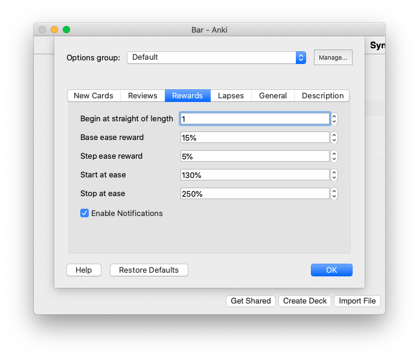
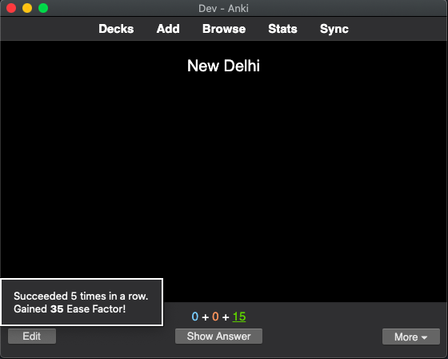
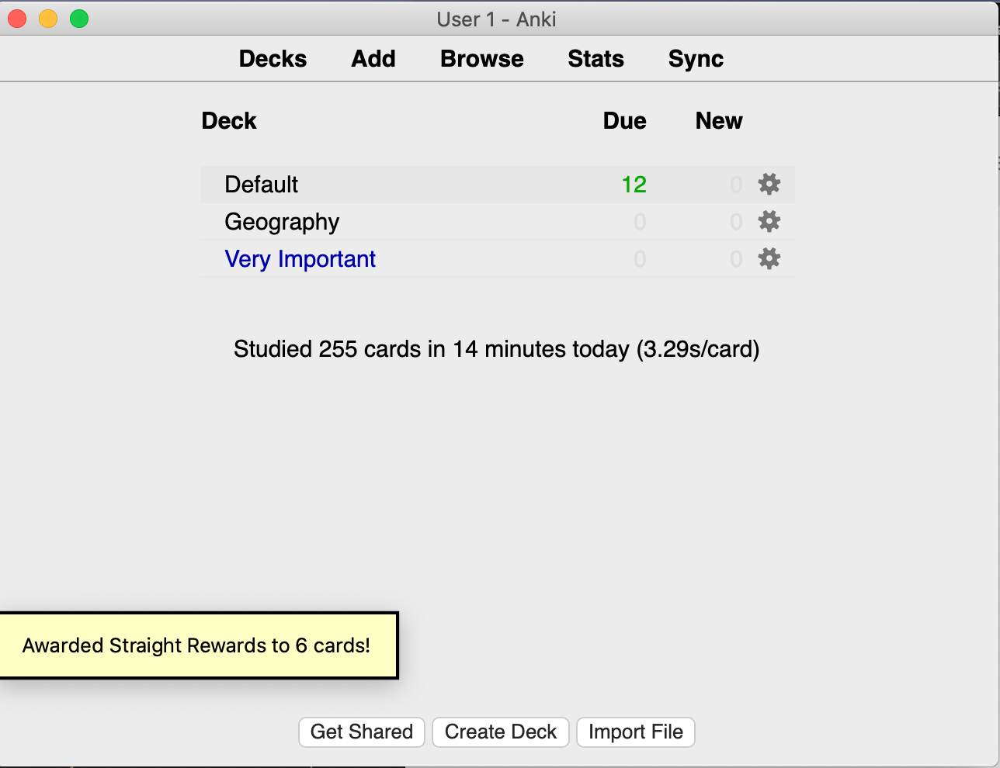

image:https://github.com/hgiesel/anki_straight_reward/workflows/Zip%20Anki%20add-ons/badge.svg[link="https://github.com/hgiesel/anki_straight_reward/actions?query=workflow%3A%22Zip+Anki+add-ons%22"]

= Straight Reward

Based on the link:https://github.com/luminousspice/anki-addons/tree/master/Straight_Reward[add-on of the same name] by link:https://github.com/luminousspice[luminousspice].

This add-on increases the ease of Anki cards when you consecutively rate them "Good", or "Easy".
Rating a card "Good", or "Easy" is considered a "success".
Once you exceed a specific amount of successes, it is considered a "straight success".
In such a case, *Straight Reward* will raise the ease of the cards.

==== Setting the Options

After installing the addon you will another option tab under the deck options called "Straight Rewards":

* *Begin at straight of length*: Length of what is considered a straight success. At this length, ease rewards will be applied. The value is the same as deactivating Straight Rewards. (default: 0)
* *Enable notifications*: Enable or disable the notifications that arise during review. (default: on)
* *Base ease reward*: One of the two values for calculating the ease reward. (default: 15)
* *Step ease reward*: One of the two values for calculating the ease reward. (default: 5)
* *Start at ease*: Only cards with an ease factor between (inclusive) "Start Ease" and "Stop Ease" are considered for ease rewards. (default: 130)
* *Stop at ease*: Only cards with an ease factor between (inclusive) "Start Ease" and "Stop Ease" are considered for ease rewards. (default: 250)

==== Calculating Ease Rewards

.Formula for calculating the Ease Reward
----
base_reward + step_reward ⋅ (strait_length - required_straight_length)
----

An Example:

. You rated a card "Good" for the sixth time in a row.
. The card currently has an ease factor of 250%.
. You have a straigth length of 4
. You have a base reward of 15%
. You have a step reward of 5%
. You have a start ease of 130%
. You have a stop ease of 270%

So in this case we have a straight success (because 6 ≥ 4). +
The formula yields: +15% + 5% ⋅ (6 - 4) = 15% + 10% = 25%+ +
So the answer is final ease is +250% + 25% = 275%+. But Wait! +
+275%+ is more than the stop ease of +270%+: So the ease will be set to the maximum ease of +270%+.

'''

== Detecting Straight Successes

The addon knows two mechanisms to detect cards which apply for an ease reward:

=== The Review Hook

The review hook increases the ease of cards during the review.
You will get a notification whenever a success straight is detected:

.Award notification

The Review hook respects the "Undo" feature.
Undoing will also undo the additional straight reward.

=== The Sync Hook

The sync hook increases the ease of cards during syncing.
Applies when you do reviews on another platform (e.g. AnkiMobile or AnkiDroid) and sync those to Desktop Anki.

.Sync notification

All ease changes applied through the sync hook are logged in the addon folder under `user_files/sync_log`.
